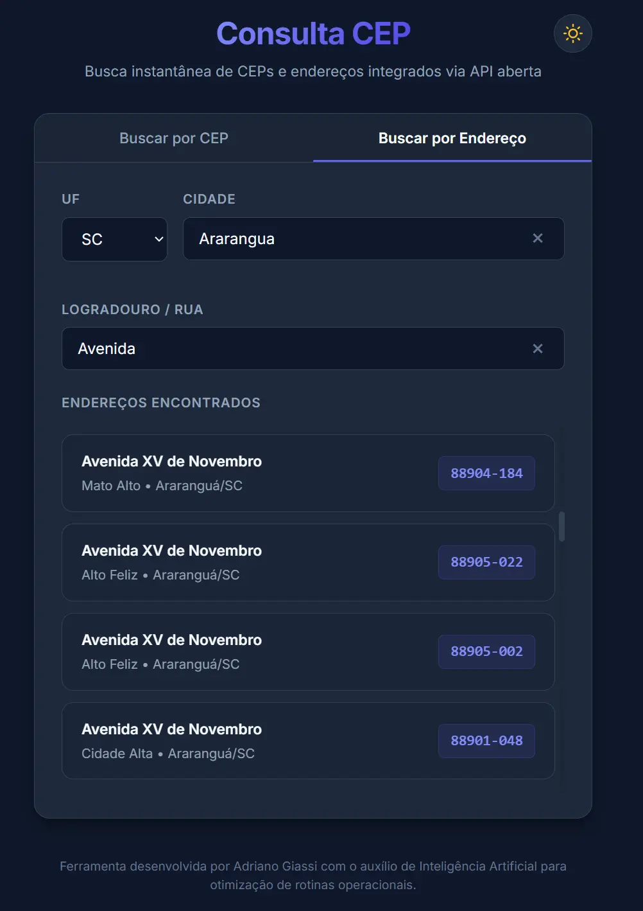

# Consulta CEP & Endereços

Ferramenta utilitária desenvolvida para acelerar fluxos de trabalho através da automação de cadastros de endereços. Realiza a consulta instantânea de CEPs e a validação de logradouros diretamente no sistema via API aberta (ViaCEP), eliminando a necessidade de consultas manuais externas. Um projeto extremamente leve, focado em produtividade operacional, performance, usabilidade e segurança de dados.

## 📸 Demonstração Visual

A interface do sistema possui um design responsivo e moderno (Mobile-First) com suporte a tema claro e escuro dinâmico:

### 🔍 Busca por CEP
Realiza a consulta automatizada ao preencher os 8 números do CEP, exibindo o endereço completo e permitindo a cópia rápida do CEP para a área de transferência.


---

### 🗺️ Busca por Endereço
Permite pesquisar o CEP inserindo a UF, a Cidade e o Logradouro (mínimo de 3 caracteres). Exibe uma lista interativa de resultados compatíveis onde o usuário pode clicar sobre a etiqueta de CEP para copiá-la instantaneamente.



---

## 🚀 Tecnologias Utilizadas

- **HTML5**: Estruturação semântica, acessível e otimizada.
- **CSS3 (Vanilla)**: Design system customizado com variáveis CSS, responsividade mobile-first, transições de opacidade e cores (fade de 0.25s) para alternância de temas.
- **JavaScript (Vanilla JS)**: Lógica pura estruturada sem frameworks externos, garantindo máxima performance de renderização.
- **API ViaCEP**: Integração ágil e sem necessidade de chaves de autenticação para consulta de dados postais.

## ✨ Recursos e Funcionalidades

- **Busca por CEP com Máscara Dinâmica**: Campo de entrada inteligente com formatação automática (`XXXXX-XXX`) que efetua a requisição no instante em que o oitavo dígito é inserido.
- **Busca por Endereço Avançada**: Grade de formulário otimizada que divide proporcionalmente a linha entre UF e Cidade, deixando o Logradouro em destaque e tela cheia.
- **Debounce de Digitação**: Atraso inteligente nas requisições (400ms para CEP e 600ms para endereço) que evita requisições excessivas à API à medida que o usuário digita.
- **Segurança Rigorosa (Anti-XSS & Path Traversal)**:
  * Sanitização completa de dados com remoção de caracteres especiais (`/`, `\`, `.`) para impedir injeção de caminhos nas URLs.
  * Validações por expressões regulares (Regex) para formato de CEP e UF.
  * Manipulação estrita do DOM através de `textContent` e `replaceChildren()` (zero uso de `innerHTML`).
- **Facilidade operacional (Auto-Select & Reset)**:
  * Auto-seleção de texto ao focar nos inputs para facilitar novas digitações sobrepostas.
  * Botões internos de limpeza rápida ("×") para limpar os campos e resetar resultados instantaneamente.
- **Persistência de Tema**: Detecção automática da preferência de cores do sistema do usuário com opção de alternância manual e persistência via `localStorage`.

## 💻 Como Executar o Projeto

Como a aplicação é estática e depende exclusivamente de tecnologias web nativas, sua execução local é extremamente simples:

### Método 1: Execução Direta
1. Faça o download ou clone o repositório em sua máquina.
2. Abra o arquivo `index.html` em qualquer navegador web moderno.

### Método 2: Servidor Local (Recomendado)
Para simular um ambiente de produção real com suporte a chamadas HTTP otimizadas, execute na pasta do projeto:
```bash
# Utilizando Python
python -m http.server 8000

# Ou utilizando Node.js (npx)
npx serve
```
Acesse a aplicação em `http://localhost:8000` (ou na porta configurada pelo terminal).

---

> ⚠️ **IMPORTANTE (Divergência ou Dúvidas sobre Dados de Endereço):**  
> Como a API pública do ViaCEP depende de atualizações periódicas da base de dados postal, é possível que ocorra um pequeno atraso (delay) em relação ao sistema oficial dos Correios. Em caso de dúvidas sobre a exatidão de um logradouro recente, consulte diretamente a ferramenta oficial no [Busca CEP Correios](https://buscacepinter.correios.com.br/app/endereco/index.php?t), que conterá sempre as informações oficiais e em tempo real.

---

> ℹ️ **NOTA:**  
> **Ferramenta desenvolvida por Adriano Giassi com o auxílio de Inteligência Artificial para otimização de rotinas operacionais.**
